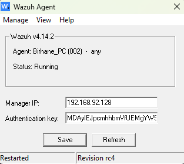
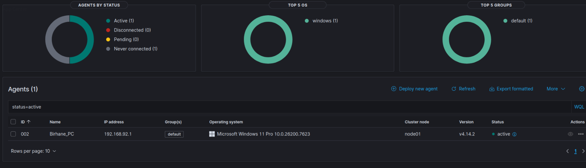
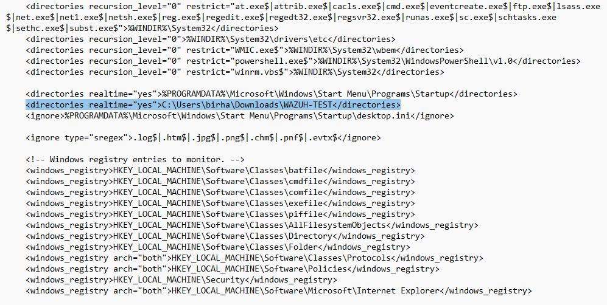

# Wazuh SIEM Lab: Windows Agent + Ubuntu Manager

This lab demonstrates deploying a Wazuh SIEM manager on Ubuntu, installing a Windows endpoint agent, and validating log ingestion by generating authentication failures. The goal is to show the full pipeline: endpoint event → agent → manager → alert.

## Architecture

- **Host Machine:** Windows 11  
- **Virtualization:** VMware Workstation  
- **SIEM Manager:** Ubuntu VM running Wazuh Manager  
- **Endpoint:** Windows host running Wazuh Agent  
- **Network:** NAT (VMware)

Windows Agent → Wazuh Manager → Wazuh Dashboard

## Environment Setup

1. Installed Ubuntu 24.04 on VMware and configured networking.
2. Installed Wazuh Manager using the official quickstart script.
3. Added a new Windows agent in the Wazuh Manager console.
4. Installed the Wazuh Windows agent and inserted the agent key.
5. Verified agent connectivity in the Wazuh dashboard.

## Agent Registration

### Windows Agent Connected
These screenshot showcase the process for Windows endpoint successfully registering and being active in the Wazuh dashboard.

## File Integrity Monitoring on Windows

### Editing Agent Configuration
After successfully conecting the agent, I tested the monitoring of a specified folder in real-time by adding an entry inside of the ossec-agent Directory block.

## Generating Authentication Failures

To test log ingestion, I locked my Windows machine and intentionally entered incorrect passwords multiple times. This generated Windows Security Event ID 4625 (failed logon).
### Failed Login Events in Wazuh
These screenshots show Wazuh ingesting the failed login events from the Windows agent.

### Detailed Alert Breakdown
This screenshot shows the expanded details of a failed login alert (Event ID 4625). It includes the logon type, failure reason, process name, and authentication details.

### Windows Event Viewer Correlation
This screenshot shows the original Windows Security Log (Event ID 4625) that corresponds to the Wazuh alert. This demonstrates how endpoint logs map directly to SIEM alerts.

## What I Learned

- How Wazuh agents authenticate and communicate with the manager.
- How real-time monitoring of file and folder changes work.
- How Windows Security logs (Event ID 4625) are generated and structured.
- How SIEMs parse, normalize, and alert on endpoint events.
- How to correlate endpoint logs with SIEM alerts for investigation.

